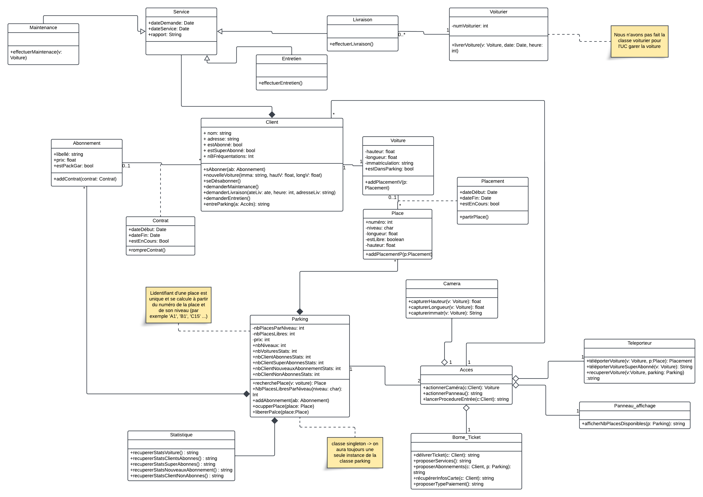
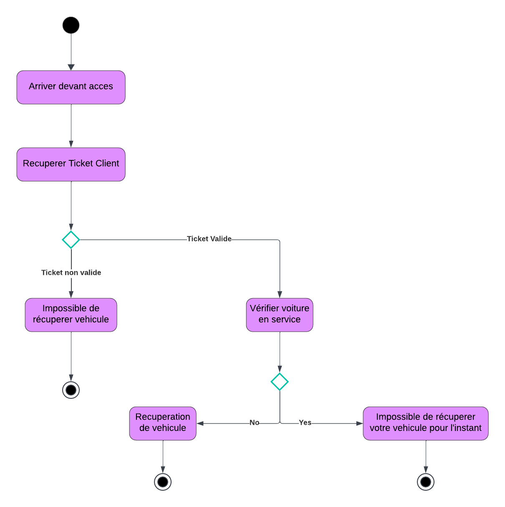
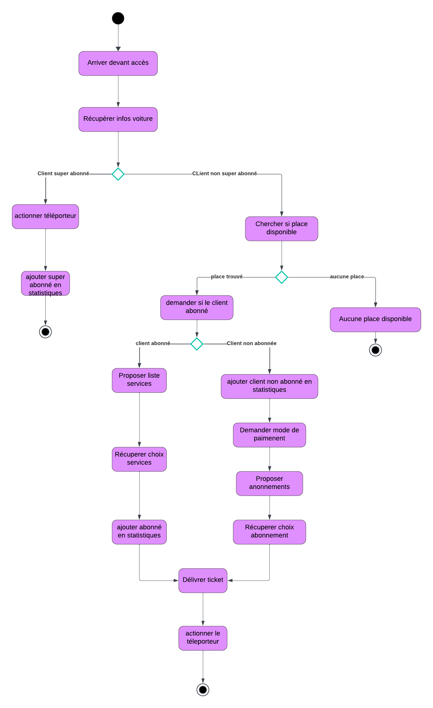

# DreamParking

---

## Description

DreamPark est un système de gestion de parking avancé, conçu pour offrir des services innovants comme le stationnement garanti, la livraison de voitures, et l'entretien des véhicules. Ce projet permet de gérer efficacement les places de parking, les accès, et les services annexes tout en offrant une expérience utilisateur fluide.

---

### Fonctionnalités principales :

- Gestion des places de parking :
  - Attribution automatique des places selon les dimensions des véhicules.
  - Mise à jour en temps réel du nombre de places disponibles sur des panneaux d'affichage.
- Services avancés :
  - Livraison de véhicules à des emplacements précis sur simple demande.
  - Entretien ou maintenance des véhicules pour les abonnés.
- Statistiques et analyses :
  - Suivi des passages pour établir des statistiques et des stratégies de fidélisation.
  - Rapport d'activité basé sur les différents services proposés.

---

## Structure du Projet

Le projet est organisé en plusieurs modules pour assurer une bonne lisibilité et facilité de maintenance :

- **Modèle** : Gestion des entités comme les clients, voitures et parking.
  - `Parking` : Classe principale représentant le parking. Gestion des places, niveaux, et disponibilités. Cette classe est un singleton.
  - `Client` : Représente les informations sur les clients et leurs abonnements. Possède des méthodes pour souscrire des services (entretien, livraison, maintenance).
  - `Voiture` : Détails des véhicules (immatriculation, dimensions, etc.).
  - `Place` : Représente une place de parking avec ses propriétés telles que le numéro, le niveau, la hauteur, et sa disponibilité.
  - `Placement` : Gère l'association d'une voiture à une place avec des détails comme les dates de début et de fin.
  - `Service` : Classe abstraite pour les services disponibles (entretien, livraison, maintenance).
    - **Sous-classes** :
      - `Entretien` : Gère les services d'entretien des véhicules.
      - `Livraison` : Permet la livraison des véhicules à des adresses spécifiques.
      - `Maintenance` : Gère les demandes de maintenance des voitures.
  - `Contrat` : Représente un contrat d'abonnement avec des détails comme la date de début, la durée, et les services inclus.
  - `Voiturier` : Classe représentant les voituriers pour les services de livraison.
  - `Abonnement` : Gestion des abonnements des clients. Intègre des propriétés comme le type d'abonnement et des méthodes pour ajouter ou résilier un contrat.

---

- **Contrôleurs** : Gestion des actions principales du système.
  - `Acces` : Gère les accès au parking via les portails et leur interaction avec les caméras.
  - `BorneTicket` : Contrôleur des bornes pour l'émission de tickets et l'interaction avec les téléporteurs.
  - `Camera` : Captures les informations des véhicules entrant, telles que l'immatriculation et les dimensions.
  - `Entretien` : Gestion des actions liées aux services d'entretien des véhicules.
  - `Livraison` : Coordination des services de livraison de véhicules via les voituriers.
  - `Maintenance` : Gestion des services de maintenance des véhicules.
  - `PanneauAffichage` : Mise à jour des panneaux indiquant les places disponibles.
  - `ReprendreVoitureController` : Gère le processus de récupération des véhicules par les clients.
  - `SeGarerController` : Gestion complète du processus de stationnement, de l'attribution de place au téléportage.
  - `StatistiquesController` : Récupération et analyse des données statistiques pour les rapports d'activité.

---

- **Vue** : Interface utilisateur basée sur Tkinter pour interagir avec le système.
  - `ReprendreVoitureVue` : Interface pour récupérer une voiture.
  - `SeGarerVue` : Interface pour garer une voiture dans le parking.
  - `StatisitqueVue` : Affichage des statistiques du parking.
  - `Application` : Menu principal et écrans d’interaction pour naviguer entre les fonctionnalités.

---

## Prérequis

- **Python 3.x**
- **Bibliothèques Python** :
  - Tkinter (intégrée dans Python).

---

## Installation

1. Clonez le dépôt :
   ```bash
   git clone https://mi-git.univ-tlse2.fr/walid.madad/dreamparkingwr.git
   ```
2. Naviguez dans le répertoire du projet :
   ```bash
   cd dreamparkingwr
   ```

## Lancement du Projet

```bash
python src/main.py
```

---

### Fonctionnement du script principal :

1. Création d'un parking avec des places disponibles.
2. Ajout de clients avec des véhicules.
3. Simulation du stationnement des voitures.
4. Interface utilisateur pour tester les différentes fonctionnalités.

---

### Utilisation

1. `Créez un client` : Chaque client est associé à une voiture et peut avoir des abonnements.
2. `Créez un parking` : Initialisez un parking avec un nombre de places, niveaux, etc.
3. `Testez le stationnement` : Utilisez les contrôleurs pour simuler l’entrée et la sortie de véhicules.
4. `Consultez les statistiques` : Affichez les données sur l’activité du parking.

---

## Diagrammes

Des diagrammes de classe et d’activité sont inclus pour mieux comprendre la structure et les interactions du système.

### Fichiers :

- **[Diagramme de Classe](DiagrammesUML/diagrammeDeClasse.png)** : 
- **[Diagramme d'Activité Reprendre Voiture](DiagrammesUML/diagrammeActiviteReprendreVoiture.png)** : 
- **[Diagramme d'Activité Se Garer et Statistique](DiagrammesUML/diagrammeActivitesSeGarerEtStats.png)** : 

---

Avec DreamPark, profitez d'un parking connecté, innovant et adapté à vos besoins !
